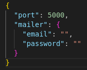

# Send Mail

<p align="center">
  <a href="https://nodemailer.com/about/">
    
  </a>
</p>

## **Nodemailer** - node js library for the ability to send mail to email

<br>

### **Library setup:**

1. **For Gmail users** - for a website to be able to send emails on your behalf, you need to give permission via the **[LINK](https://myaccount.google.com/lesssecureapps?pli=1&rapt=AEjHL4MowTqgNL1yPY351L2AtC0VMhcKz8QaNy3jZjHAd5Ke8NY92zNzQYmSqXfEHCCJ_YN2hjPkH-sm4H488SfG-6cd_8pArA)**

2. **for users of other mailboxes** - this parameter is not needed

### **Verification:**

1. **To enter your mailbox** - in folder `config` there are two files

- To use mail in development mode:
   - `default.json`
- For using mail in production:
   - `production.json`
2. **Both have the following entry**

    

3. **Add correct data!** 

   

> `email`=\<Youre mail\>

> `password`=\<Your password\>

> Be sure to be case sensitive!!!

<br>
<br>

# Build project

<p align="center">
  <a href="https://webpack.js.org/">
    
  </a>
</p>

## **Webpack** - it is an open source JavaScript module builder

<br>

### **Sbokschik setting:**

1. **webpack.config.js** - collector config file

### **Uing terminal you can:**

1. To build a project in the client-side development mode

   ```
   npm run build
   ```

2. To build the client side with automatic server updates

   ```
   npm run watch
   ```

3. To run only the server side

   ```
   npm run start
   ```

4. To automatically update the server side

   ```
   npm run server
   ```

5. To run the entire project in development mode

   ```
   npm run dev
   ```

6. To run the entire project in production mode

   ```
   npm run prod
   ```

7. To get statistics of the project load

   ```
   npm run stats
   ```

<br>

> All these scripts are contained in the file `package.json`

> The project is launched on `localhost:5000`
